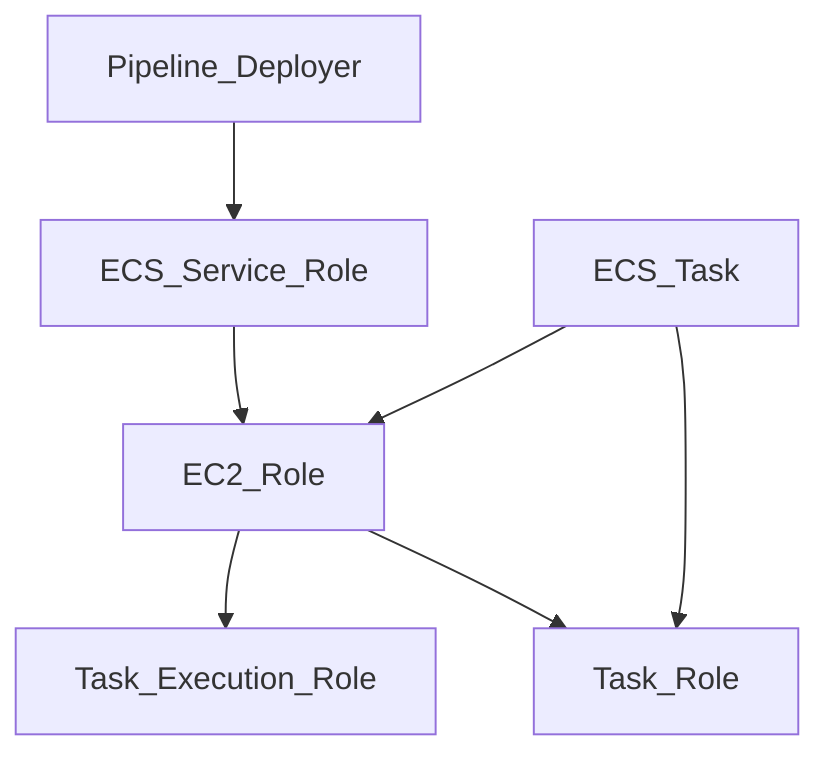

# AWS Batch staging POC

This document describes a POC of using Metaflow to create AWS Batch tasks in staging.

See PR https://github.com/zendesk/ml-platform-infra/pull/224 for the terraform setup and [here](https://github.com/zendesk/ml-research-amis/pull/13) for the ECS cluster AMIs.

Terraform creates 1 compute cluster that can autoscale with zendesk base ubuntu images. It has 4 IAM roles:

* ECS service role: This role is required to be able to create autoscale groups, ec2 instances, launch them with a copy of the launch template created in Terraform.
* EC2 role: The role given to the ECS cluster ec2 instances. NB: This role is shared with all ecs/batch tasks, so currently we plan to have this be a minimal role that all teams can share. See [aws docs](https://docs.aws.amazon.com/AmazonECS/latest/developerguide/task-iam-roles.html)
* Task execution role: The role given to docker as it starts the task, so this requires pull ECR images. Hopefully all teams will share a list of general plain images
* Task role: The role is given to the task itself. If the task requires access to AWS services or resources we define the permissions here. Ideally this would contain the team permissions, as long as we can provide a way to select this role per team.



This setup allows metaflow to create the AWS Batch tasks from staging Service Catalog ec2 instance, with the hello world task, using this python file [helloaws](files/helloaws.py)

The ECS job definition is created before hand in Terraform, and the ec2 role on Service Catalog is only allowed to submit jobs. This setup enforces which IAM role can be given to the task.

The task itself will download the python code from s3, so the role requires that read access. Also it appears Metaflow does not have a config option to set the s3 client SSE flag, so we will need to get approval to use an S3 bucket with default all SSE and remove the S3 policy that would deny object PUT without the client explicitly setting SSE.

## Open Questions

We are limited to 50 task queues per region per account.

Currently considering 2 options for shared queues.
* 1 adhoc and 1 production queue, both shared with all teams
* 1 adhoc and a production queue per team

We also need to find if it is usable to have a shared CPU/GPU mixed queue. AWS Blog [here](https://aws.amazon.com/blogs/compute/creating-an-aws-batch-environment-for-mixed-cpu-and-gpu-genomics-workflows/) recommends not sharing a queue with different hardware workloads. The main problem I've seen so far in testing is that Metaflow doesn't seem to have 2 different queue settings, so it is easy to forget to change the queue config and put the wrong job on the wrong queue. We should try to find a way to mitigate the issues in the above, ie prevent CPU workloads from being run on GPU hardware and using resources that they don't require.

## Testing Batch task submit from Service Catalog

```
ubuntu_ssm@ip-172-16-209-161:~/metaflow$ python helloaws.py run
Metaflow 2.8.0 executing HelloAWSFlow for user:ubuntu_ssm
Validating your flow...
    The graph looks good!
Running pylint...
    Pylint is happy!
2023-03-06 02:36:37.419 Workflow starting (run-id 1678070196433151):
2023-03-06 02:36:37.644 [1678070196433151/start/1 (pid 1205054)] Task is starting.
2023-03-06 02:36:39.103 [1678070196433151/start/1 (pid 1205054)] HelloAWS is starting.
2023-03-06 02:36:39.104 [1678070196433151/start/1 (pid 1205054)] 
2023-03-06 02:36:39.105 [1678070196433151/start/1 (pid 1205054)] Using metadata provider: local@/home/ubuntu_ssm/metaflow
2023-03-06 02:36:39.944 [1678070196433151/start/1 (pid 1205054)] 
2023-03-06 02:36:39.944 [1678070196433151/start/1 (pid 1205054)] The start step is running locally. Next, the
2023-03-06 02:36:39.945 [1678070196433151/start/1 (pid 1205054)] 'hello' step will run remotely on AWS batch.
2023-03-06 02:36:39.945 [1678070196433151/start/1 (pid 1205054)] If you are running in the Netflix sandbox,
2023-03-06 02:36:39.945 [1678070196433151/start/1 (pid 1205054)] it may take some time to acquire a compute resource.
2023-03-06 02:36:40.322 [1678070196433151/start/1 (pid 1205054)] Task finished successfully.
2023-03-06 02:36:40.667 [1678070196433151/hello/2 (pid 1205079)] Task is starting.
2023-03-06 02:36:42.116 [1678070196433151/hello/2 (pid 1205079)] [c4239151-c399-4fa1-82cc-54424a6ccc2e] Task is starting (status SUBMITTED)...
2023-03-06 02:36:47.235 [1678070196433151/hello/2 (pid 1205079)] [c4239151-c399-4fa1-82cc-54424a6ccc2e] Task is starting (status RUNNABLE)...
2023-03-06 02:37:17.417 [1678070196433151/hello/2 (pid 1205079)] [c4239151-c399-4fa1-82cc-54424a6ccc2e] Task is starting (status RUNNABLE)...
2023-03-06 02:37:47.572 [1678070196433151/hello/2 (pid 1205079)] [c4239151-c399-4fa1-82cc-54424a6ccc2e] Task is starting (status RUNNABLE)...
2023-03-06 02:38:17.749 [1678070196433151/hello/2 (pid 1205079)] [c4239151-c399-4fa1-82cc-54424a6ccc2e] Task is starting (status RUNNABLE)...
2023-03-06 02:38:47.841 [1678070196433151/hello/2 (pid 1205079)] [c4239151-c399-4fa1-82cc-54424a6ccc2e] Task is starting (status RUNNABLE)...
2023-03-06 02:39:17.940 [1678070196433151/hello/2 (pid 1205079)] [c4239151-c399-4fa1-82cc-54424a6ccc2e] Task is starting (status RUNNABLE)...
2023-03-06 02:39:48.105 [1678070196433151/hello/2 (pid 1205079)] [c4239151-c399-4fa1-82cc-54424a6ccc2e] Task is starting (status RUNNABLE)...
2023-03-06 02:40:18.191 [1678070196433151/hello/2 (pid 1205079)] [c4239151-c399-4fa1-82cc-54424a6ccc2e] Task is starting (status RUNNABLE)...
2023-03-06 02:40:24.797 [1678070196433151/hello/2 (pid 1205079)] [c4239151-c399-4fa1-82cc-54424a6ccc2e] Task is starting (status STARTING)...
2023-03-06 02:40:38.635 [1678070196433151/hello/2 (pid 1205079)] [c4239151-c399-4fa1-82cc-54424a6ccc2e] Task is starting (status RUNNING)...
2023-03-06 02:40:37.346 [1678070196433151/hello/2 (pid 1205079)] [c4239151-c399-4fa1-82cc-54424a6ccc2e] Setting up task environment.
2023-03-06 02:40:44.259 [1678070196433151/hello/2 (pid 1205079)] [c4239151-c399-4fa1-82cc-54424a6ccc2e] Downloading code package...
2023-03-06 02:40:44.917 [1678070196433151/hello/2 (pid 1205079)] [c4239151-c399-4fa1-82cc-54424a6ccc2e] Code package downloaded.
2023-03-06 02:40:44.934 [1678070196433151/hello/2 (pid 1205079)] [c4239151-c399-4fa1-82cc-54424a6ccc2e] Task is starting.
2023-03-06 02:40:45.700 [1678070196433151/hello/2 (pid 1205079)] [c4239151-c399-4fa1-82cc-54424a6ccc2e] Metaflow says: Hi from AWS!
2023-03-06 02:40:47.488 [1678070196433151/hello/2 (pid 1205079)] [c4239151-c399-4fa1-82cc-54424a6ccc2e] Task finished with exit code 0.
2023-03-06 02:40:48.964 [1678070196433151/hello/2 (pid 1205079)] Task finished successfully.
2023-03-06 02:40:49.259 [1678070196433151/end/3 (pid 1205357)] Task is starting.
2023-03-06 02:40:50.775 [1678070196433151/end/3 (pid 1205357)] HelloAWS is finished.
2023-03-06 02:40:51.686 [1678070196433151/end/3 (pid 1205357)] Task finished successfully.
2023-03-06 02:40:51.809 Done!
```
config for above
```
ubuntu_ssm@ip-172-16-209-161:~$ cat ~/.metaflowconfig/config.json 
{
    "METAFLOW_BATCH_CONTAINER_REGISTRY": "713408432298.dkr.ecr.us-west-2.amazonaws.com/base/zendesk/docker-images-base/",
    "METAFLOW_BATCH_JOB_QUEUE": "arn:aws:batch:us-east-1:589470546847:job-queue/ml-apac-trisolaris-metaflow",
    "METAFLOW_DATASTORE_SYSROOT_S3": "s3://zendesk-ml-pipelines-staging-poc/team-name/metaflow",
    "METAFLOW_DATATOOLS_SYSROOT_S3": "s3://zendesk-ml-pipelines-staging-poc/team-name/metaflow/data",
    "METAFLOW_DEFAULT_DATASTORE": "s3",
    "METAFLOW_ECS_S3_ACCESS_IAM_ROLE": "arn:aws:iam::589470546847:role/ml-apac-trisolaris-metaflow-ecs-task"
}
```

note the IAM role and docker image settings are *ignored* since Terraform created the job definition, so the role and image are definied within Terraform infra setup.
